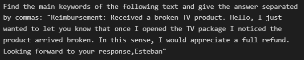

# Instant Email Reply Using GPT3
## Soft Skills for Applied Computer Scientists Project (Vrije Universiteit Brussel)

```
Course Instructors: 
+ Nikos Deligiannis
+ Tanmoy Mukherjee
+ Giannis Bekoulis

Student Group:
+ Esteban Velásquez Rendón
+ Viktor Stavrinopoulos
+ Dávid Juraj Szücs
+ Sincy Raj

MSc. Applied Computer Science 2021-2022
```

## Introduction:

Email is one of the most favored modes of communication on the internet despite the increase in social networking platforms. With the increase in growth of Email Communication, it is necessary to organize the information for faster and easier processing. Usually, the companies receive huge number of emails to the single email address, and it is often the case where responding to this huge traffic of emails without a long delay is essential. To meet this challenge, we came up with a coherent solution for email semi-automatic reply system to increase email productivity, to reduce the average email handling time in companies and thus to improve the customer service and make the company operations effortless and reliable. The proposed solution is based on Natural Language Processing (NLP) techniques like Natural Language Understanding (NLU), which is a subtopic of natural-language processing in artificial intelligence that deals with machine reading comprehension, and Natural Language Generation (NLG).

This is an implementation done in python that makes use of GPT3 to extract the email information from outlook, interpret the message extracting the main keywords and finally providing a suggested response for the user to that email.  The application pipeline looks as follows:


The main steps are then the following:


***Note: Please open and see the jupyter file to see step by step how the steps are deployed***

# Results:

From the following received email:


The following information was extracted:


Only relevant information is preserved: Title+Body, as follows:


Now we can create the prompt that will be given to GPT3. We just need to add a textual command and include the previous parragraph, just as follows:



The resulting keywords that GPT3 found are the following for this example:


With these keywords we can ask GPT3 to generate a response email. So we formulate a new prompt as follows:


The resulting response email from GPT3 is presented below:


With this response we create a automatic reply (waiting for user approval) on outlook that looks as follows:


It is saved in Drafts Outlook folder, so the user can either press send directly, or modify the email response if necessary.


***Note: Please open and see the jupyter file to see step by step how the steps are deployed***
